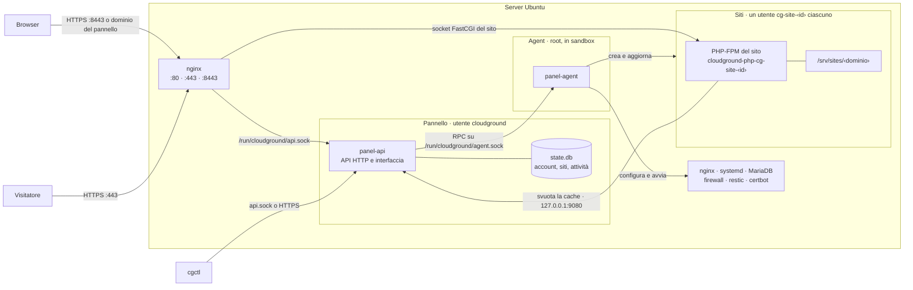

CloudGround divide il lavoro tra un processo che parla con il mondo e non ha privilegi, e un
processo che ha i privilegi e non parla con il mondo. I siti girano a parte, ognuno con il suo
utente.

## Il disegno {#diagram}

## Il pannello {#the-panel}

`panel-api` serve l'interfaccia web e l'API HTTP. Gira come utente `cloudground`, senza alcuna
capability e in una sandbox di systemd che gli lascia scrivere solo `/var/lib/cloudground`. Lì tiene
`state.db`, il database con account, siti, attività e registro attività; i segreti dentro il
database sono cifrati con una chiave in `secret.key`.

Non ascolta su una porta TCP pubblica. systemd gli passa il socket Unix `/run/cloudground/api.sock`,
che solo nginx può aprire: così l'unico client dell'API è il proxy, ed è lui a dire da quale
indirizzo arriva la richiesta. Il connettore WordPress dei siti usa un secondo ascolto, in chiaro
e solo su `127.0.0.1:9080`, che risponde a due sole chiamate: lo svuotamento della cache e il
controllo di salute.

Ogni operazione lunga (creare un sito, un backup, un rilascio) diventa un'**attività** in una coda
salvata nel database. L'attività sopravvive a un riavvio del pannello e il browser ne segue i
progressi in tempo reale.

## L'agent {#the-agent}

`panel-agent` fa tutto ciò che richiede root: utenti di sistema, file di nginx e PHP, database,
certificati, firewall, backup. Ascolta solo sul socket `/run/cloudground/agent.sock` e accetta una
connessione solo se:

- il processo dall'altra parte è root o l'utente del pannello, come dice il kernel;
- la richiesta porta il token condiviso di `/etc/cloudground/agent.token`.

Anche l'agent gira in una sandbox: può scrivere solo nei percorsi che il suo lavoro richiede, e ogni
programma che lancia la eredita. Parla con il sistema attraverso adattatori tipizzati: systemd via
D-Bus, nginx con `nginx -t` prima di ogni ricarica, restic con i suoi codici di uscita. Costruisce
sempre liste di argomenti, mai stringhe di shell, e non passa mai segreti sulla riga di comando.

## I siti {#the-sites}

Ogni sito ha il suo utente di sistema `cg-site-<id>`, la sua cartella sotto `/srv/sites/<dominio>`
e, se esegue PHP, il suo processo PHP-FPM con OPcache e APCu propri. Tutti i processi del sito
(PHP, attività pianificate, wp-cli, la shell) girano nella stessa slice di systemd e nella stessa
sandbox, che nasconde gli altri siti e la configurazione del server. Come funziona questa
separazione lo spiega [l'isolamento dei siti](./site-isolation.mdx).

## Perché è fatto così {#why}

- **Un bug nel pannello non è root.** La parte esposta al browser non ha privilegi. Per toccare il
  sistema deve chiedere all'agent, che controlla ogni richiesta e i siti che nomina.
- **Un sito non vede gli altri.** Cache di PHP, file e processi sono per sito, quindi un plugin
  compromesso resta nel suo sito.
- **Il server resta coerente.** L'agent controlla la configurazione prima di caricarla e la
  rimette com'era se nginx la rifiuta. Ogni cinque minuti il pannello confronta i file che gestisce
  con quelli scritti e segnala le modifiche esterne nella dashboard.

## Prossimo passo {#next}

Per seguire una visita dal browser fino a PHP, leggi [il percorso di una richiesta](./request-path.mdx).
