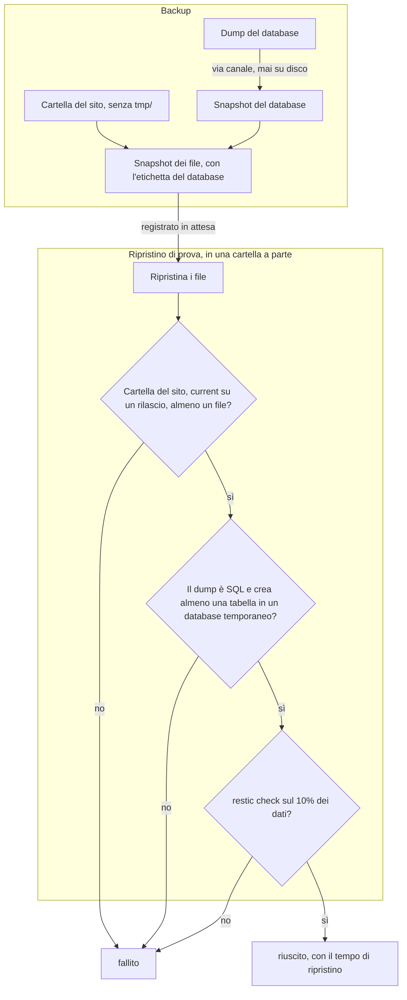

Un backup che non è mai stato ripristinato è una speranza. Per questo in CloudGround ogni backup
viene ripristinato per prova prima di contare, e la prova fa tutto quello che farebbe un
ripristino vero, tranne toccare il sito.

## Com'è fatto un backup {#anatomy}

I backup di tutti i siti vanno in un solo repository restic, fuori dal server, cifrati con la
password del repository. Un backup è fatto di due snapshot:

1. **il database**: `mariadb-dump` scrive in un canale che restic legge direttamente. Il dump non
   tocca mai il disco, e in particolare la cartella del sito, che appartiene all'utente del sito:
   lì potrebbe essere sostituito tra il dump e il backup;
2. **i file**: tutta la cartella del sito tranne `tmp/`. Lo snapshot dei file porta un'etichetta
   con l'identificativo dello snapshot del database, e il pannello registra lo snapshot dei file.

Se il dump fallisce, o anche un solo file non si legge, il backup fallisce e restic dimentica gli
snapshot parziali: nel repository non restano metà backup che nessuno usa.

Un solo processo restic lavora su un repository alla volta, e un backup interrotto toglie il suo
blocco dal repository prima di uscire, così il backup successivo parte.

## Il ripristino di prova {#restore-test}

La prova ripristina lo snapshot in una cartella del server riservata all'agente e controlla gli
stessi requisiti di un ripristino vero: la cartella del sito, il collegamento `current` che punta
a un rilascio che esiste nello snapshot, almeno un file. Poi legge l'inizio del dump, lo importa
in un database temporaneo con lo stesso client isolato di un ripristino, conta le tabelle (per
WordPress serve la tabella delle opzioni) ed elimina il database temporaneo. Infine `restic check`
rilegge un 10% dei dati del repository. Il tempo fino all'importazione è la stima di quanto
durerebbe un ripristino.

Le regole che ne seguono:

- un backup nasce *in attesa* e solo la prova lo porta a *riuscito* o *fallito*;
- la prova parte nello stesso lavoro del backup e arriva in fondo anche se il lavoro viene
  interrotto; a ogni avvio il pannello rifà la prova di ogni backup rimasto *in attesa*;
- la conservazione non toglie mai il backup più recente *riuscito*, né uno *in attesa*;
- il pannello non elimina quei due backup nemmeno su richiesta.

## Il ripristino vero {#restore}

Un ripristino comincia con uno **snapshot di sicurezza** del sito com'è adesso, verificato con
la stessa prova. Se la prova fallisce, il ripristino si ferma: il sito non è stato toccato.

Poi:

- i file ripristinati vengono preparati accanto alla cartella del sito, sullo stesso disco, e
  scambiati con quella attuale in una sola operazione del kernel: non c'è un momento senza sito;
- con il database (modalità *Tutto* o *Solo il database*), il database viene salvato, svuotato e ricreato dal dump, così le tabelle nate dopo lo snapshot
  non restano;
- PHP del sito riparte (svuotando la cache del codice e degli oggetti), nginx ricarica;
- se il sito non riparte, file e database tornano com'erano.

Alla fine la cache di pagina viene svuotata, non eliminata: la sua cartella resta, perché senza
quella cartella il sito smetterebbe di usare la cache.

## Prossimo passo {#next}

[Esegui un ripristino di prova](/data/run-a-restore-test) su uno snapshot.
