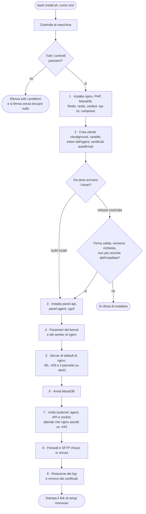

`installer/install.sh` prepara un server Ubuntu vuoto e avvia il pannello. Tutto ciò che stampano
i programmi che lancia finisce in `/var/log/cloudground-install.log`; sul terminale vedi solo i
nove passi e la loro durata.

## I passi {#steps}

## Cosa controlla prima {#preflight}

Il controllo iniziale, prima dei passi, fa tutte le verifiche e riporta tutti i problemi insieme, così correggi la macchina in
un solo giro:

- Ubuntu 24.04 o 26.04 LTS, architettura amd64;
- almeno 900 MB di `MemTotal`: un server da 1 GB ne riporta un po' meno di 1024, e deve passare;
- almeno 10 GB liberi su `/`;
- porte 80 e 443 libere, perché nginx di CloudGround deve averle;
- nessun altro pannello di controllo installato.

## I pacchetti {#packages}

PHP arriva in una versione diversa per sistema: 8.4 dal repository `ondrej/php` su Ubuntu 24.04,
8.5 dai pacchetti di Ubuntu su 26.04. Il servizio PHP-FPM della distribuzione viene spento: ogni
sito avrà il suo processo PHP-FPM, avviato dall'agent. Anche Redis resta spento.

restic e composer sono scaricati in una versione fissata e installati solo se il loro SHA-256
corrisponde a quello scritto nell'installer. wp-cli è controllato contro lo SHA-512 pubblicato
accanto al file.

## I binari {#binaries}

{/* TODO(verify): il percorso della release scaricata (firma del manifest, versione, downgrade). Non verificabile il 2026-10-10: non esiste ancora una release firmata pubblica. Verificati la build locale e la riesecuzione. */}

Con `CLOUDGROUND_LOCAL_BUILD` l'installer copia i binari da una cartella locale. Altrimenti scarica
la release e la installa solo se:

- il manifesto `SHA256SUMS` è firmato dalla chiave ed25519 in `CLOUDGROUND_RELEASE_PUBKEY`;
- il manifesto nomina la versione chiesta in `CLOUDGROUND_VERSION` (o una qualsiasi, con `latest`);
- la versione non è più vecchia di quella già installata, né della più recente a cui il pannello si
  è aggiornato. `CLOUDGROUND_ALLOW_DOWNGRADE=1` toglie solo quest'ultimo controllo, per un ritorno
  indietro voluto;
- ogni binario corrisponde al suo hash nel manifesto.

Le unità systemd scaricate passano dallo stesso manifesto.

## Le scelte sul server {#server-choices}

- **Kernel e nginx.** Code di accettazione più lunghe e più file aperti, perché un picco non faccia
  scartare connessioni prima che un worker sia occupato. `worker_connections` sale a 4096; se nginx
  rifiuta la configurazione modificata, l'installer rimette l'originale.
- **Server di default.** Su :80 e :443 un nome sconosciuto non riceve nulla (`444`), tranne le
  verifiche dei certificati. Su :8443 risponde il pannello, con un certificato autofirmato suo che
  resta anche dopo aver dato un dominio al pannello: puoi sempre raggiungerlo per IP.
- **MariaDB.** L'installer lo avvia soltanto; la sua configurazione la calcola l'agent in base a
  memoria e CPU del server.
- **Firewall.** Se ufw è attivo, apre 22, 80, 443, 443/udp e 8443.
- **SFTP.** Gli utenti di sistema dei siti (`cg-site-*`) entrano solo in SFTP, chiusi nella
  cartella del sito. La [shell del sito](/access/site-shell) usa un accesso a parte.
- **Log.** I log dei siti ruotano ogni giorno, o a 1 GB, e se ne tengono 14.

## Rilanciarlo {#rerun}

Se trova un pannello già attivo, l'installer lo aggiorna sul posto: i controlli sulle porte lasciano
passare il suo nginx, i segreti e i certificati esistenti restano, e i servizi vengono riavviati
sui nuovi binari.

## Prossimo passo {#next}

Per provarlo su un server, segui il tutorial [Installa CloudGround](/tutorials/install).
