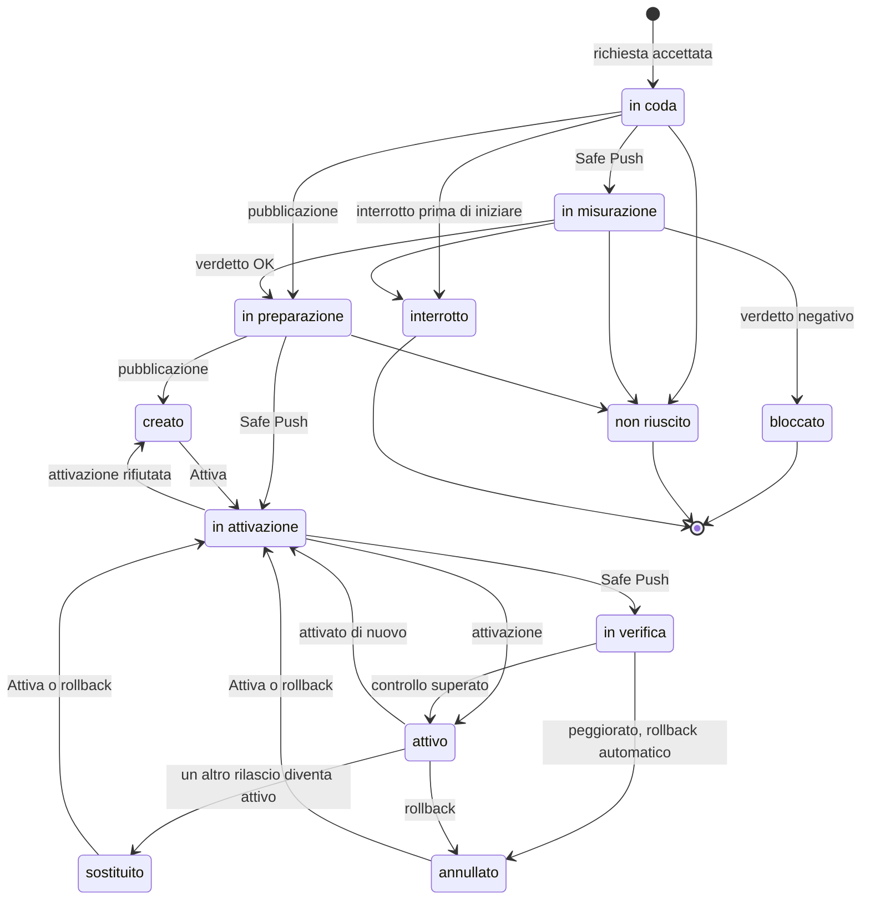

Il codice di un sito non si modifica sul posto. Ogni pubblicazione crea un **rilascio** nuovo,
una cartella che dopo non cambia più, e il sito serve sempre quello indicato da un unico
collegamento.

## La cartella di un sito {#layout}

```text
/srv/sites/<dominio>/
├── current -> releases/<id>     il rilascio attivo
├── releases/
│   ├── initial/                 il primo, creato con il sito
│   └── <id>/                    uno per pubblicazione
└── shared/                      configurazione e file caricati
```

nginx e PHP servono il sito attraverso `current`. Attivare un rilascio vuol dire sostituire
quel collegamento con uno nuovo, in una sola operazione: ogni richiesta vede il rilascio vecchio
o quello nuovo, mai un misto. Poi PHP ricarica, così la cache del codice serve il codice nuovo.

Ogni rilascio collega `wp-config.php` e i file caricati a quelli in `shared/`. Per questo un
rollback cambia il codice ma non la configurazione, né il database, né i file caricati.

`releases/` appartiene a root, non all'utente del sito: se fosse sua, potrebbe sostituire un
rilascio con un collegamento e far servire a nginx qualsiasi cartella del server.

Ogni rilascio ha un identificativo ULID: 26 caratteri che cominciano con l'ora di creazione, così
i rilasci si ordinano per età. Dopo ogni attivazione restano il rilascio attivo, quelli più
recenti, e i 5 più recenti tra quelli più vecchi.

## Gli stati di un rilascio {#states}

Ogni pubblicazione è registrata nel pannello e passa per questi stati. Il pannello rifiuta
qualsiasi passaggio che non è nel diagramma.



Un'attivazione rifiutata torna allo stato da cui era partita: *creato*, *sostituito*, *annullato*
o *attivo*. Un sito ha al massimo un rilascio *attivo*: quando un altro diventa attivo, il
precedente diventa *sostituito* nella stessa scrittura.

## Dove torna un rollback {#rollback-target}

Prima di ogni attivazione il pannello chiede all'agente quale rilascio è attivo in quel momento,
e lo annota come punto di ritorno. Un rollback senza destinazione torna lì; se il punto non è
noto, torna all'ultimo rilascio *sostituito*. Il pannello non lascia mai scegliere all'agente
"il rilascio più vecchio di quello attuale", perché potrebbe essere un rilascio creato e mai
attivato, cioè mai provato.

Un rilascio può tornare online solo se è già stato attivo. Un rilascio che Safe Push ha annullato
perché peggiorava il sito è segnato come peggiorato e non diventa mai una destinazione.

## I dati seguono il server {#records-follow-the-server}

Quello che il sito serve è quello che indica `current`, non quello che dice il database del
pannello. Dopo un'attivazione o un rollback rifiutati, e dopo un riavvio che ha interrotto una
pubblicazione, il pannello rilegge `current` e allinea i suoi dati:

- un'attivazione interrotta prima del cambio torna *creato*; una che ha già cambiato `current`
  diventa *attiva*, e se veniva da Safe Push viene verificata adesso;
- un rilascio costruito da una pubblicazione *non riuscita* viene eliminato dal server;
- se il sito serve un rilascio diverso da quello registrato, il rilascio porta la nota *Il sito
  serve questo rilascio; i dati del pannello indicavano un altro rilascio attivo* e compare un
  avviso.

Una verifica dopo Safe Push interrotta a mano lascia il rilascio *attivo* con la nota *non
verificato* e un avviso: il pannello non lo dichiara mai buono senza il controllo.

## Prossimo passo {#next}

[Pubblica un rilascio](/data/deploy-a-release).
