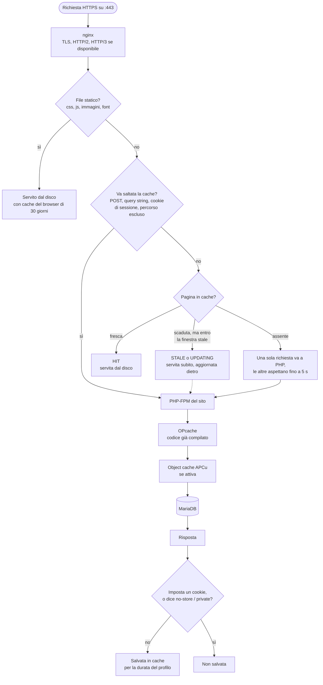

Una pagina servita dalla cache non tocca PHP: nginx la legge dal disco. Questa pagina segue una
richiesta a un sito PHP (WordPress, WooCommerce, PHP, Laravel) e mostra dove si ferma. I valori
esatti sono nel [riferimento della cache](/reference/cache-behaviour).

## Il percorso {#diagram}

## nginx e la cache di pagina {#page-cache}

La cache di pagina è la cache FastCGI di nginx, una per sito, su disco sotto
`/var/cache/cloudground/<dominio>`. La chiave di una pagina è schema, metodo, host e indirizzo. Ogni
risposta da PHP, quando la cache di pagina è attiva, porta l'header `X-CloudGround-Cache`, con lo stato che nginx ha dato alla richiesta:
`HIT`, `MISS`, `BYPASS`, `EXPIRED`, `STALE`, `UPDATING` o `REVALIDATED`.

Tre meccanismi tengono basso il carico su PHP:

- **Coalescing.** Se cento visitatori chiedono la stessa pagina scaduta nello stesso momento, solo
  uno arriva a PHP. Gli altri aspettano la sua risposta, fino a 5 secondi.
- **Stale-while-revalidate.** Una pagina appena scaduta viene servita subito com'era, e nginx la
  rigenera in background. Lo stesso succede se PHP risponde con un errore o non risponde.
- **Parametri di tracciamento.** Un indirizzo con solo parametri come `utm_*`, `fbclid` o `gclid`
  usa la stessa voce della pagina senza parametri: una campagna non manda ogni clic a PHP.

## Quando la cache non c'entra {#bypass}

Ogni tipo di sito ha le sue regole per saltare la cache: un `POST`, una query string che non sia
solo tracciamento, un cookie di sessione (per WordPress l'accesso, il carrello di WooCommerce), un
percorso come `/wp-admin` o `/checkout`. Una richiesta con l'header `Authorization` salta sempre la
cache.

La regola più importante vale per tutti: **una risposta che imposta un cookie non va mai in cache.**
Così una pagina generata per un visitatore con sessione non viene servita a un altro.

## PHP {#php}

Se la richiesta arriva a PHP, la serve il processo PHP-FPM del sito, che ha solo i dati di quel sito:

- **OPcache** tiene in memoria il codice PHP compilato. Controlla se un file è cambiato al massimo
  ogni 60 secondi; dopo un rilascio il pannello ricarica PHP perché il codice nuovo si veda subito.
- **Object cache** (WordPress, se la attivi) tiene in APCu il risultato delle query ripetute:
  rende più veloci wp-admin, il carrello e tutte le pagine che la cache di pagina non può servire.
- **MariaDB** è sullo stesso server, configurato in base a memoria e CPU.

PHP comprime da sé la sua risposta, così la cache salva la pagina già compressa e la serve senza
comprimerla di nuovo.

## Gli altri tipi di sito {#other-types}

Un sito statico non ha PHP: nginx serve i file dal disco. Un reverse proxy passa ogni richiesta al
suo upstream. Per nessuno dei due c'è la cache di pagina.

## Prossimo passo {#next}

Per togliere dalla cache una pagina o un sito intero, segui [svuota la cache](/data/purge-the-cache).
