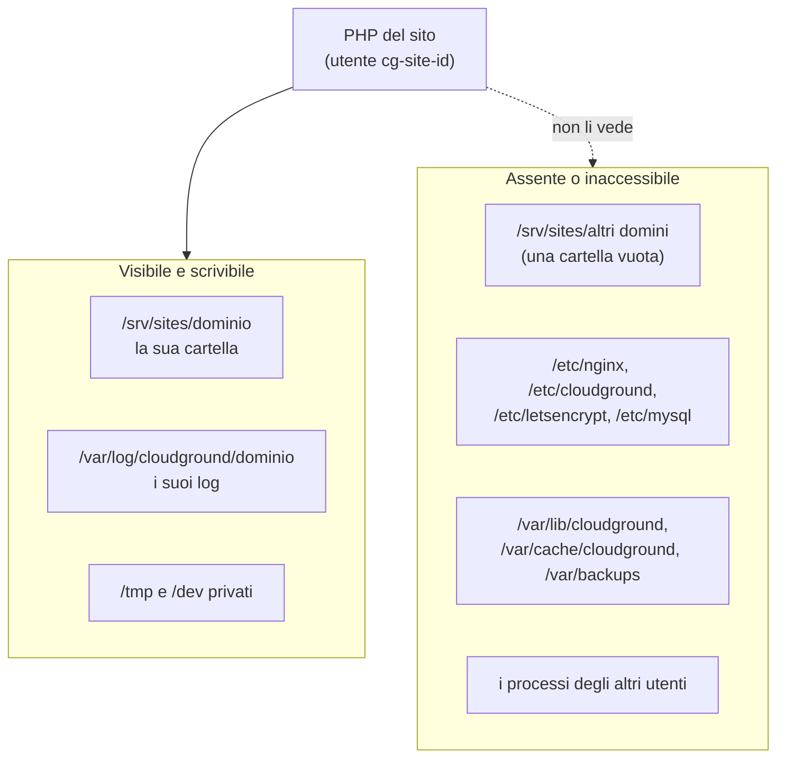

Su un server CloudGround ogni sito è un inquilino che non si fida degli altri. Un plugin compromesso su
un sito non deve leggere i file di un altro, la sua cache o il suo database, e non deve arrivare al
pannello. L'isolamento ha più strati, e ognuno regge anche se un altro cede.

## Un utente per sito {#one-user-per-site}

Ogni sito ha il suo utente e il suo gruppo di sistema, `cg-site-<id>`, senza shell di login. La sua
cartella, `/srv/sites/<dominio>`, è di root con il gruppo del sito e permessi 0750: gli altri siti non
la aprono. nginx entra perché il suo utente fa parte del gruppo di ogni sito.

Lo scheletro della cartella (la radice, `releases/`, `.ssh/` e il link `current`) resta di root. Se fosse
del sito, il sito potrebbe sostituire un rilascio con un link simbolico e puntare `current`, e con lui la
cartella servita da nginx, dove vuole. Il server rimette questi permessi prima di ogni rilascio e rollback.

Il database del sito, `site_<id>`, ha un utente con lo stesso nome che ha permessi solo su quel database,
con al massimo 50 connessioni. La password è generata a caso alla creazione.

## Un PHP per sito, in una sandbox {#one-php-per-site}

Ogni sito con PHP ha un suo processo master PHP-FPM, che gira come l'utente del sito. Due motivi:

- OPcache e APCu vivono nella memoria condivisa del master. Con un master per più siti, ognuno potrebbe
  leggere e sovrascrivere gli oggetti in cache degli altri.
- La dimensione di quelle cache si imposta per master: un master per sito permette una dimensione per
  sito.

Il servizio del master gira in una sandbox di systemd. Il sito vede questo:

In dettaglio:

- `/srv/sites` e `/var/log/cloudground` sono, per il sito, cartelle vuote in memoria in cui è montata
  solo la sua cartella e la sua cartella dei log;
- il resto del sistema è in sola lettura, e la configurazione del pannello, di nginx, dei certificati e
  del database, lo stato del pannello, la cache di pagina e i backup sono inaccessibili;
- i processi degli altri utenti sono invisibili, `/tmp` e `/dev` sono privati;
- nessun privilegio in più: nessuna capability, i programmi setuid non danno privilegi, nessun
  namespace nuovo, solo socket Unix e IP;
- PHP non può avviare comandi: `exec`, `passthru`, `shell_exec`, `system`, `proc_open` e `popen` sono
  disattivati.

Le attività pianificate, i comandi wp-cli e la shell SSH del sito girano con la stessa sandbox, presa
dalla stessa lista: non possono divergere. Tutti i processi del sito stanno in un suo slice di systemd,
`cg-site-<id>.slice`, così l'eliminazione del sito li ferma tutti insieme.

### Perché non open_basedir {#why-not-open-basedir}

`open_basedir` è un controllo di PHP stesso sui percorsi che apre. Il confine qui è il namespace dei mount
del servizio: quello che il sito non deve vedere non c'è proprio, per PHP e per qualsiasi programma che
PHP potrebbe usare. Sul server di prova, `open_basedir` costava il 28% delle richieste non in cache al
secondo. Il pannello non lo attiva.

## nginx e i link simbolici {#nginx-and-symlinks}

nginx può leggere ogni sito, perché è nel gruppo di tutti. Per questo il vhost di ogni sito ha
`disable_symlinks if_not_owner`: nginx segue un link solo se il link e il suo bersaglio hanno lo stesso
proprietario. Un link che il sito crea verso la cartella di un altro sito è suo, il bersaglio no, e nginx
lo rifiuta. Con una cartella pubblica (`public_root`) il controllo parte da `current`, e il pannello
rifiuta una cartella pubblica che passa per un link.

Il routing che un amministratore scrive per un sito non può uscire dalla sua cartella, né fare proxy
verso i servizi del server: lo spiega [Modifica il routing](/sites/edit-routing).

## Il server lavora dentro la cartella del sito {#root-inside-the-tree}

Le operazioni del pannello sui file di un sito (rilasci, ripristini, permessi, copie per lo staging) le fa
un processo con i privilegi di root. Il sito può rinominare o sostituire con un link qualsiasi cosa che
possiede, anche mentre root ci sta lavorando. Per questo ogni operazione di root su una cartella di un
sito apre i percorsi con `openat2` e `RESOLVE_BENEATH`: è il kernel a garantire, a ogni apertura, che il
percorso resti dentro la cartella. Un link che punta fuori viene rifiutato, non seguito. Senza `openat2`
l'operazione fallisce, non ripiega su un'apertura normale.

I link del sito stesso (`current`, `wp-config.php`, `wp-content/uploads`) sono relativi, così si risolvono
dentro la cartella.

## SFTP {#sftp}

Con SFTP attivo, l'utente del sito entra chiuso nella sua cartella (chroot) e con il solo server SFTP
interno, senza una shell. Con SFTP spento, l'utente è in un gruppo a cui il server SSH rifiuta l'accesso,
anche con una chiave.

## Prossimo passo {#next}

[Il ciclo di vita di un sito](./site-lifecycle.mdx): come questi pezzi vengono creati e tolti.
