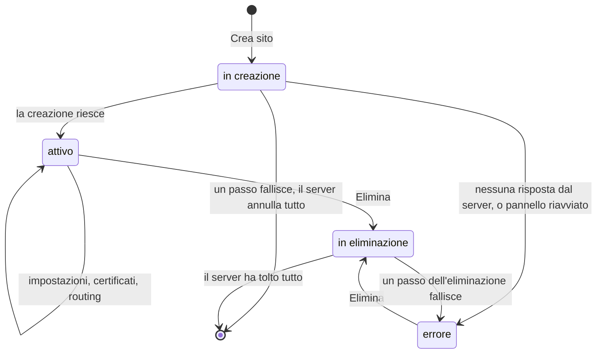
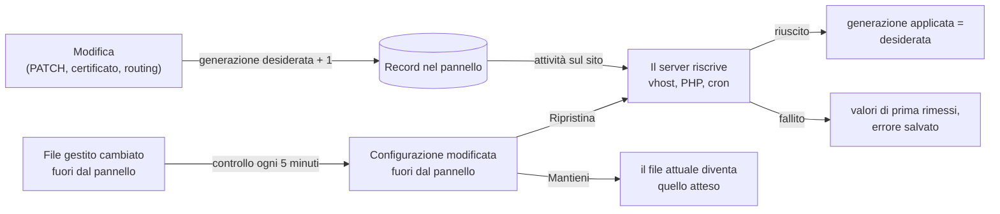

Un sito vive in due posti. Il pannello tiene il **record**: il dominio, il tipo e le impostazioni che vuoi.
Il server tiene **quello che gira**: l'utente di sistema, i file, il PHP, il vhost. Il ciclo di vita è il
modo in cui i due restano d'accordo, anche quando qualcosa si interrompe a metà.

## Gli stati {#the-states}

**In creazione.** Il pannello salva il record e mette in coda l'attività **Creazione sito**. Il server
crea, in ordine: l'utente, la cartella, il database, il primo rilascio con l'applicazione, il vhost e il
PHP, e per WordPress il cron. Ogni passo ha il suo contrario. Se un passo fallisce, il server disfa quelli
già fatti in ordine inverso, e il pannello toglie il record: non resta niente a metà.

**Errore, invece di sparire.** Se il pannello non riceve risposta, perché il server non risponde o
l'attività scade, non sa cosa è stato creato. Il sito potrebbe esistere e servire pagine. Il pannello
allora tiene il record nello stato **errore**: se lo togliesse, resterebbe un sito che nessuna pagina
mostra e il cui dominio non si potrebbe più creare. Un'eliminazione pulisce tutto.

**Attivo.** Il sito risponde. Le modifiche passano tutte dalla configurazione desiderata (sotto).

**In eliminazione.** Il server toglie prima il routing, così il sito smette di rispondere, poi i processi,
il PHP, le attività pianificate, il database, i certificati, l'utente e infine i file. Ogni passo toglie
solo quello che c'è ancora, quindi un'eliminazione ripetuta riesce. Se un passo fallisce, gli altri
vanno avanti lo stesso e il sito finisce in **errore** con tutti i motivi.

Un'attività interrotta da un riavvio del pannello mette in **errore** un sito rimasto **in creazione** o
**in eliminazione**. Una creazione annullata prima di partire toglie il record; un'eliminazione annullata
prima di partire rimette lo stato di prima.

## Desiderato e applicato {#desired-and-applied}

Il record ha un numero di **generazione desiderata**, che sale a ogni modifica della configurazione, e
uno di **generazione applicata**, che dice fino a dove il server l'ha messa in pratica.

- Ogni modifica è un'attività con la serratura del sito: due modifiche dello stesso sito non si
  sovrappongono mai, e ogni attività rilegge il sito com'è al momento in cui parte.
- Se il server non riesce ad applicarla, il pannello rimette i valori di prima, ma solo dei campi che una
  modifica successiva non ha già cambiato.
- Il server non riscrive un file che non è cambiato e non ricarica nginx se nessun file di nginx è
  cambiato. Un servizio PHP la cui configurazione esce uguale continua a girare, con la sua cache.

## I file gestiti e le modifiche esterne {#managed-files-and-drift}

Ogni file che il server scrive per un sito (il vhost, la zona di cache, la configurazione e il servizio
PHP, la password dello staging, il connector di WordPress) viene registrato con la sua impronta SHA-256.
Ogni 5 minuti il pannello confronta le impronte con i file sul disco. Un file cambiato fuori dal pannello
compare nella dashboard sotto **Configurazione modificata fuori dal pannello**, e il pannello non
sovrascrive niente da solo. Un amministratore sceglie:

- **Ripristina**: il server riscrive la configurazione del sito com'è nel record;
- **Mantieni**: la versione attuale del file diventa quella attesa.

Ogni 5 minuti il pannello rifà anche la configurazione dei siti dopo un aggiornamento del pannello o
quando cambia il numero dei siti, perché la memoria per i worker PHP si divide tra i siti.

## Prossimo passo {#next}

[L'isolamento dei siti](./site-isolation.mdx): cosa separa un sito dagli altri.
