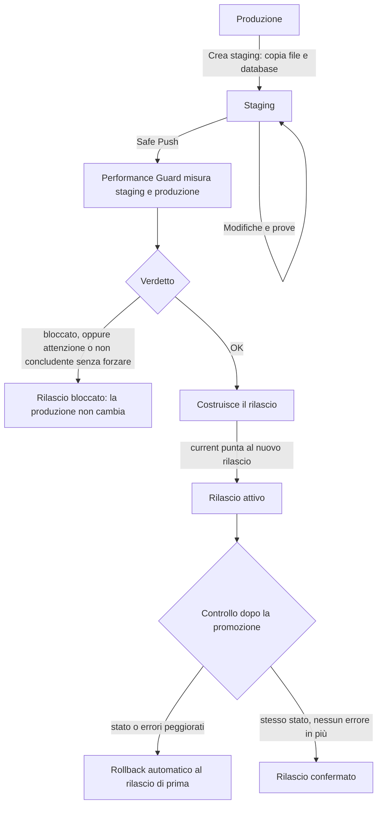

Lo staging serve a provare una modifica su una copia della produzione. Safe Push la pubblica solo
se non rende il sito più lento, più pesante o rotto. Performance Guard è la parte che misura.

## Lo staging è un sito vero {#a-real-site}

La copia di staging è un sito come gli altri: ha il suo utente di sistema, la sua cartella, il
suo database, il suo pool PHP e il suo vhost, su `staging.<dominio>`. Quando la crei, il
pannello:

- copia il rilascio attivo e i file caricati della produzione, senza seguire collegamenti, così la
  copia non può arrivare ai file della produzione;
- copia il database della produzione in quello dello staging;
- su WordPress, mette nella configurazione il database dello staging, `WP_ENVIRONMENT_TYPE` =
  `staging`, un token del pannello diverso da quello della produzione e nuove chiavi di sessione:
  chi entra nello staging non può firmare un accesso alla produzione;
- riscrive gli indirizzi della produzione con quelli dello staging, anche nella forma JSON
  (`\/\/dominio`) usata dai blocchi;
- chiede ai motori di ricerca di non indicizzarlo e lo protegge con una password.

## Cosa si pubblica {#what-is-published}

**Il codice.** Safe Push costruisce un nuovo rilascio della produzione dal rilascio attivo dello
staging, oppure dal codice della produzione con solo i percorsi scelti presi dallo staging. In
entrambi i casi `wp-config.php` e i file caricati restano quelli della produzione: un rilascio
che arriva dallo staging non ne porta le credenziali.

**Le tabelle.** Il database si pubblica a parte, tabella per tabella. Alcune tabelle non si
pubblicano mai, perché in produzione contengono dati vivi che lo staging ha in una versione
vecchia:

- gli utenti di WordPress (`*_users`, `*_usermeta`);
- su un negozio, anche post, metadati e commenti (dove vivono ordini e recensioni) e le tabelle di
  ordini, sessioni, clienti, token di pagamento, download, scorte riservate e chiavi API.

Un sito è un negozio se è di tipo WooCommerce, se usa il profilo *commerce*, o se il suo database
ha tabelle di WooCommerce installato a mano. Prima di sostituire le tabelle, il pannello fa uno
snapshot di sicurezza della produzione e lo verifica; dopo, rimette il valore di
`blog_public` della produzione, perché quello dello staging ne bloccherebbe l'indicizzazione.

## Il flusso di Safe Push {#flow}

## Come misura Performance Guard {#how-guard-measures}

Due siti sullo stesso server non rispondono mai con gli stessi tempi: un backup, un cron o un
vicino rumoroso cambiano tutto da un minuto all'altro. Performance Guard toglie quel rumore con
tre scelte.

**Misure a coppie.** Per ogni pagina fa 200 giri. In ogni giro chiede la pagina a staging e
produzione, in un ordine casuale. Quello che succede sul server cade su entrambe le metà dello
stesso giro, quindi il rapporto tra le due misura solo la differenza di codice.

**Il tempo di PHP.** Ogni richiesta salta la cache di pagina e porta una chiave che chiede al
plugin del pannello di scrivere, in fondo alla pagina, il tempo di generazione, le query e la
memoria. Performance Guard usa quel tempo, non quello della rete. Su un sito senza il plugin usa
il tempo misurato dal client, e il rapporto lo dice.

**Riscaldamento.** Prima di misurare, manda a ogni lato almeno il doppio delle richieste dei
worker PHP, così nessuna misura è la prima di un worker con la cache del codice fredda.

Una pagina dà un verdetto **bloccato** se:

- lo staging risponde con uno stato HTTP diverso da quello della produzione in più del 10% dei
  giri;
- lo staging ha più errori della produzione, oltre l'1%;
- con il 95% di confidenza è più lento di oltre il 10%, e la differenza mediana supera 25 ms;
- fa almeno il 50% di query in più (e almeno 5), o usa almeno il 30% di memoria in più (e almeno
  32 MiB).

Con meno certezza il verdetto è **attenzione**; quando il server oscilla troppo per decidere, o ci
sono meno di 20 coppie misurabili, è **non concludente**. Safe Push pubblica con *OK*; con
*attenzione* o *non concludente* solo se la richiesta lo forza; con *bloccato* mai.

La soglia è 10% perché staging e produzione sono siti diversi, con database e cache propri, e lo
stesso codice può differire di qualche punto. I 200 giri servono a vedere comunque un
peggioramento del 30%: nelle prove di taratura, quasi sempre bloccato, mentre due versioni uguali
non vengono bloccate. Il prezzo è il tempo: 2 × 200 rendering per pagina, circa 30 secondi per una pagina che PHP
genera in 60 ms e circa due minuti a 300 ms.

## Il controllo dopo la promozione {#after-promotion}

Appena il nuovo rilascio è attivo, la cache è vuota e PHP ha appena ricaricato: i tempi non sono
confrontabili e non vengono giudicati. Performance Guard manda 20 richieste per pagina alla
produzione e controlla solo stato ed errori. Se una pagina risponde con uno stato diverso da
prima, o con più errori, il pannello torna al rilascio di prima e segna quello nuovo come
peggiorato, così non torna più online per errore.

## Prossimo passo {#next}

[Staging e Safe Push](/data/staging-and-safe-push): i passi nel pannello.
