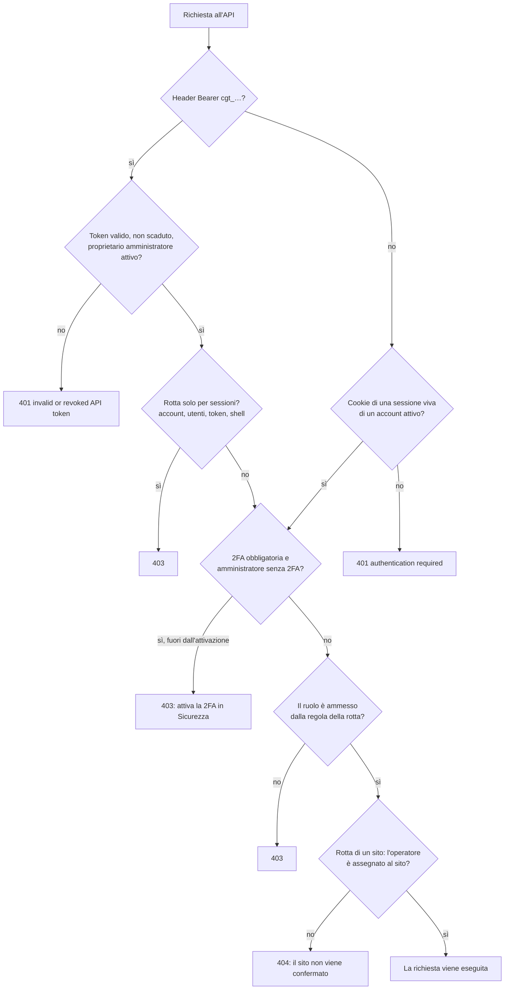

Ogni account ha esattamente uno di tre ruoli. Per assegnarli vedi [utenti e ruoli](/access/users-and-roles).

| Ruolo | Valore API | Raggio |
| --- | --- | --- |
| **Amministratore** | `admin` | Tutto il server. |
| **Operatore** | `operator` | Solo i siti assegnati, e le loro copie di staging. |
| **Sola lettura** | `readonly` | Vede tutto il server, non modifica nulla. |

## Come il pannello decide {#how-the-panel-decides}

Ogni richiesta passa questi controlli, in quest'ordine. Il primo che rifiuta risponde.

Un sito fuori dalla portata di un operatore risponde **404**, non 403: il pannello non conferma che
esista.

## Le regole delle rotte {#route-rules}

Ogni rotta dell'API ha una di queste regole.

| Regola | Amministratore | Operatore | Sola lettura |
| --- | --- | --- | --- |
| aperta | sì | sì | sì |
| account collegato | sì | sì, sui siti assegnati | sì |
| tutto il server (`global`) | sì | no | sì |
| gestione (`manage`) | sì | sì, sui siti assegnati | no |
| amministratore (`admin`) | sì | no | no |

## Cosa può fare ogni ruolo {#what-each-role-can-do}

*Vede* significa leggere; *sì* significa anche modificare. Per l'operatore, tutto vale solo sui siti
assegnati.

| Area | Amministratore | Operatore | Sola lettura |
| --- | --- | --- | --- |
| Elenco e dettagli dei siti | sì | vede i suoi | vede |
| Creare ed eliminare siti | sì | no | no |
| Impostazioni del sito e versione PHP | sì | sì | no |
| Editor del routing (Vhost) | sì | no | no |
| Certificati del sito | sì | sì | vede |
| Svuotare e riscaldare la cache | sì | sì | vede le statistiche |
| Rilasci: pubblicare, promuovere, rollback | sì | sì | vede |
| Staging e Safe Push | sì | sì | no |
| Backup: eseguire, ripristino di prova, ripristinare | sì | sì | vede |
| Backup: eliminare, conservazione, provare il repository | sì | no | no |
| File: elenco | sì | sì | vede |
| File: leggere, scrivere, caricare, scaricare | sì | sì | no |
| Database: query, esportare, importare | sì | sì | vede i dettagli |
| DB Studio: tabelle, righe, query di lettura | sì | sì | sì, con un utente del database in sola lettura |
| DB Studio: modificare, alterare, esportare, importare | sì | sì | no |
| WordPress: accesso a wp-admin, aggiornamenti, object cache | sì | sì | vede i plugin |
| Accesso SFTP e chiavi "solo SFTP" | sì | sì | vede le chiavi |
| Shell del sito e chiavi "shell" | sì, da una sessione | no | no |
| Attività pianificate | sì | sì | vede |
| Importare una migrazione | sì | sì, senza cambiare il limite di espansione | no |
| Log di un sito | sì | sì | sì |
| Log del server, servizi, firewall, stato e metriche | sì | no | vede |
| Riavviare servizi, regole del firewall | sì | no | no |
| Modifiche fatte fuori dal pannello | sì | no | vede |
| Registro attività | vede | no | vede |
| Impostazioni del pannello | sì | no | vede (segreti mascherati) |
| Dominio del pannello, aggiornamenti del pannello | sì | no | no |
| Avvisi | vede, archivia | vede i suoi, archivia | vede |
| Attività in background | vede, annulla | vede le sue, annulla quelle dei suoi siti | vede |
| Utenti | sì, da una sessione | no | vede |
| Token API | sì, da una sessione | no | no |
| Il proprio account: password, 2FA, sessioni, profilo | sì | sì | sì |

## Token API {#api-tokens}

Un token API non ha permessi propri: agisce come l'amministratore che l'ha creato, finché quel
proprietario è un amministratore attivo, e segue la sua stessa regola sulla verifica in due passaggi.
Non ci sono token limitati a un'area. Solo un amministratore crea token.

Un token non raggiunge mai le rotte solo per sessioni: il proprio account (password, 2FA, sessioni,
profilo), gli utenti, i token e la shell dei siti. Non può nemmeno aggiungere una chiave di tipo
"shell". Questi rifiuti rispondono **403**.

Il pannello revoca i token di un account quando la sua password cambia o viene reimpostata, quando
spegne la verifica in due passaggi, quando viene disattivato, declassato o eliminato, e con
`panel-api recover-admin`.

## Il token del connettore {#connector-token}

Ogni sito WordPress ha un token del connettore, separato dagli account, che serve solo al plugin del
sito per chiedere al pannello di svuotare la cache delle sue pagine. Non dà accesso a nient'altro.

## Prossimo passo {#next}

Crea gli account con il ruolo giusto: [utenti e ruoli](/access/users-and-roles).
