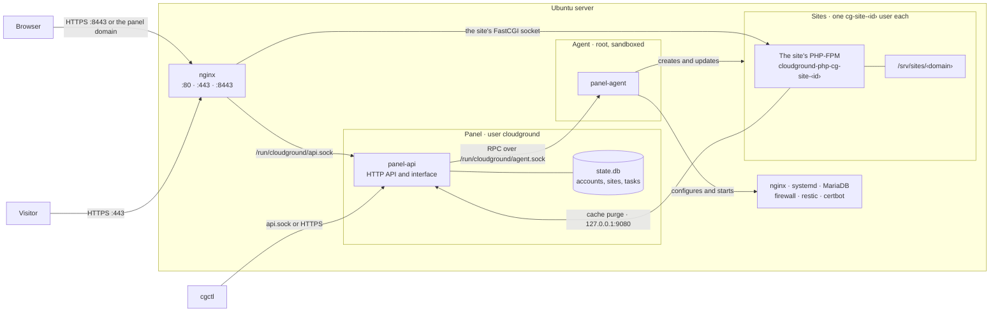

CloudGround splits the work between a process that talks to the world and has no privileges, and a
process that has the privileges and does not talk to the world. The sites run apart, each with its
own user.

## The picture {#diagram}

## The panel {#the-panel}

`panel-api` serves the web interface and the HTTP API. It runs as the user `cloudground`, with no
capabilities, in a systemd sandbox that lets it write only `/var/lib/cloudground`. It keeps
`state.db` there, the database of accounts, sites, tasks and the audit log; the secrets inside the
database are encrypted with a key in `secret.key`.

It does not listen on a public TCP port. systemd hands it the Unix socket
`/run/cloudground/api.sock`, which only nginx can open: the API's one client is the proxy, and the
proxy is what says which address a request comes from. The sites' WordPress connector uses a
second listener, plaintext and only on `127.0.0.1:9080`, that answers two calls only: the cache
purge and the health check.

Every long operation (creating a site, a backup, a release) becomes a **task** in a queue stored in
the database. The task survives a panel restart, and the browser follows its progress live.

## The agent {#the-agent}

`panel-agent` does everything that needs root: system users, nginx and PHP files, databases,
certificates, the firewall, backups. It listens only on the socket `/run/cloudground/agent.sock`
and accepts a connection only when:

- the process on the other side is root or the panel's user, as the kernel reports it;
- the request carries the shared token from `/etc/cloudground/agent.token`.

The agent runs in a sandbox too: it can write only to the paths its work needs, and every program it
starts inherits that sandbox. It talks to the system through typed adapters: systemd over D-Bus,
nginx with `nginx -t` before every reload, restic through its exit codes. It always builds argument
lists, never shell strings, and never passes a secret on a command line.

## The sites {#the-sites}

Each site has its own system user `cg-site-<id>`, its own folder under `/srv/sites/<domain>` and,
if it runs PHP, its own PHP-FPM process with its own OPcache and APCu. Every process of the site
(PHP, scheduled tasks, wp-cli, the shell) runs in the same systemd slice and the same sandbox,
which hides the other sites and the server's configuration. [Site isolation](./site-isolation.mdx)
explains how that separation works.

## Why it is built this way {#why}

- **A bug in the panel is not root.** The part exposed to the browser has no privileges. To touch
  the system it must ask the agent, which checks every request and the sites it names.
- **A site cannot see the others.** PHP caches, files and processes are per site, so a compromised
  plugin stays inside its site.
- **The server stays consistent.** The agent tests configuration before loading it and puts it back
  when nginx refuses it. Every five minutes the panel compares the files it manages with what it
  wrote and reports outside changes on the dashboard.

## Next step {#next}

To follow a visit from the browser to PHP, read [the path of a request](./request-path.mdx).
