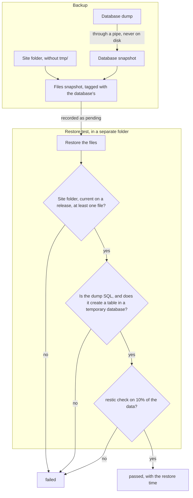

A backup that has never been restored is a hope. That is why in CloudGround every backup is
restored as a test before it counts, and the test does everything a real restore would do, except
touch the site.

## What a backup is made of {#anatomy}

Every site's backups go into one restic repository, off the server, encrypted with the repository
password. A backup is two snapshots:

1. **the database**: `mariadb-dump` writes into a pipe that restic reads directly. The dump never
   touches the disk, and in particular not the site folder, which belongs to the site user: there
   it could be swapped between the dump and the backup;
2. **the files**: the whole site folder except `tmp/`. The files snapshot carries a tag with the
   database snapshot's ID, and the panel records the files snapshot.

If the dump fails, or even one file cannot be read, the backup fails and restic forgets the partial
snapshots: no half backups that nothing uses stay in the repository.

Only one restic process works on a repository at a time, and an interrupted backup removes its
lock from the repository before exiting, so the next backup runs.

## The restore test {#restore-test}

The test restores the snapshot into a folder on the server reserved for the agent and checks the
same requirements as a real restore: the site folder, the `current` link pointing at a release
that exists in the snapshot, at least one file. Then it reads the start of the dump, imports it
into a temporary database with the same sandboxed client a restore uses, counts the tables (for
WordPress the options table must be there) and drops the temporary database. Finally `restic
check` reads 10% of the repository's data again. The time up to the import is the estimate of how
long a restore would take.

The rules that follow:

- a backup starts *pending* and only the test moves it to *passed* or *failed*;
- the test runs in the same job as the backup and runs to its end even if the job is interrupted;
  at every start the panel tests again every backup left *pending*;
- retention never removes the newest *passed* backup, nor a *pending* one;
- the panel does not delete those two backups even when asked to.

## The real restore {#restore}

A restore starts with a **safety snapshot** of the site as it is now, checked with the same test.
If the test fails, the restore stops: the site was not touched.

Then:

- the restored files are prepared next to the site folder, on the same disk, and swapped with the
  current one in a single kernel operation: there is no moment without a site;
- with the database (modes *Everything* or *Database only*), the database is saved, emptied and recreated from the dump, so tables born after the snapshot
  do not stay;
- the site's PHP restarts (emptying the code and object caches), nginx reloads;
- if the site does not come back, files and database go back to what they were.

At the end the page cache is emptied, not removed: its folder stays, because without that folder
the site would stop caching.

## Next step {#next}

[Run a restore test](/data/run-a-restore-test) on a snapshot.
