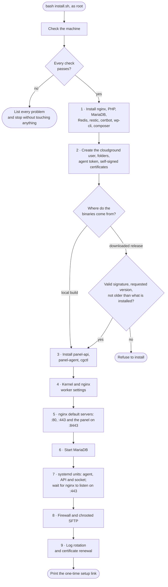

`installer/install.sh` prepares an empty Ubuntu server and starts the panel. Everything the programs
it runs print goes to `/var/log/cloudground-install.log`; on the terminal you see only the nine steps
and how long each took.

## The steps {#steps}

## What it checks first {#preflight}

The initial check, before the steps, runs every test and reports every problem together, so you fix the machine in one
pass:

- Ubuntu 24.04 or 26.04 LTS, amd64 architecture;
- at least 900 MB of `MemTotal`: a 1 GB server reports a little under 1024, and must pass;
- at least 10 GB free on `/`;
- ports 80 and 443 free, because CloudGround's nginx must own them;
- no other control panel installed.

## The packages {#packages}

PHP comes in a different version per system: 8.4 from the `ondrej/php` repository on Ubuntu 24.04,
8.5 from Ubuntu's own packages on 26.04. The distribution's PHP-FPM service is switched off: each
site gets its own PHP-FPM process, started by the agent. Redis stays off too.

restic and composer are downloaded at a pinned version and installed only if their SHA-256 matches
the one written in the installer. wp-cli is checked against the SHA-512 published next to it.

## The binaries {#binaries}

{/* TODO(verify): the downloaded-release path (manifest signature, version, downgrade). Not verifiable on 2026-10-10: no signed public release exists yet. The local build and the rerun were verified. */}

With `CLOUDGROUND_LOCAL_BUILD` the installer copies the binaries from a local folder. Otherwise it
downloads the release and installs it only when:

- the `SHA256SUMS` manifest is signed by the ed25519 key in `CLOUDGROUND_RELEASE_PUBKEY`;
- the manifest names the version asked for in `CLOUDGROUND_VERSION` (or any, with `latest`);
- the version is not older than the one already installed, nor than the newest the panel has updated
  itself to. `CLOUDGROUND_ALLOW_DOWNGRADE=1` lifts only that last check, for a deliberate step back;
- every binary matches its hash in the manifest.

The downloaded systemd units go through the same manifest.

## The choices on the server {#server-choices}

- **Kernel and nginx.** Longer accept queues and more open files, so a burst does not drop
  connections before any worker is busy. `worker_connections` goes up to 4096; if nginx refuses the
  changed configuration, the installer puts the original back.
- **Default servers.** On :80 and :443 an unknown name gets nothing (`444`), except certificate
  challenges. On :8443 the panel answers, with a self-signed certificate of its own that stays after
  you give the panel a domain: you can always reach it by IP.
- **MariaDB.** The installer only starts it; the agent calculates its configuration from the
  server's memory and CPUs.
- **Firewall.** If ufw is active, it opens 22, 80, 443, 443/udp and 8443.
- **SFTP.** The sites' system users (`cg-site-*`) get SFTP only, locked in the site's folder. The
  [site shell](/access/site-shell) uses a separate login.
- **Logs.** Site logs rotate daily, or at 1 GB, and 14 are kept.

## Running it again {#rerun}

When it finds a panel already running, the installer upgrades it in place: the port checks let its
own nginx through, the existing secrets and certificates stay, and the services restart on the new
binaries.

## Next step {#next}

To try it on a server, follow the [Install CloudGround](/tutorials/install) tutorial.
