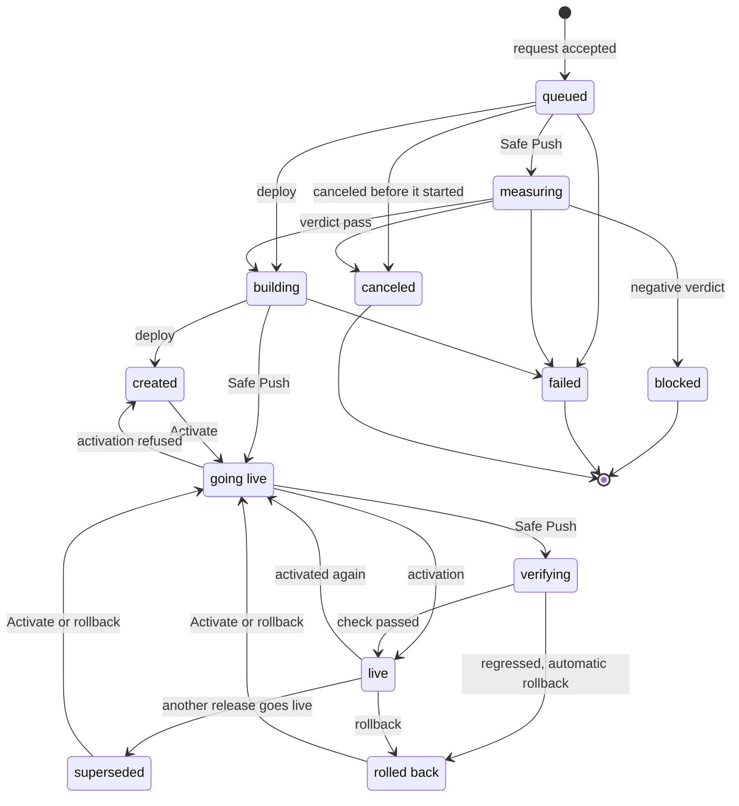

A site's code is never changed in place. Every deploy creates a new **release**, a folder that
never changes afterwards, and the site always serves the one a single link names.

## A site's folder {#layout}

```text
/srv/sites/<domain>/
├── current -> releases/<id>     the live release
├── releases/
│   ├── initial/                 the first, made with the site
│   └── <id>/                    one per deploy
└── shared/                      configuration and uploaded files
```

nginx and PHP serve the site through `current`. Activating a release means replacing that link
with a new one, in a single operation: every request sees the old release or the new one, never a
mix. Then PHP reloads, so the code cache serves the new code.

Every release links `wp-config.php` and the uploaded files to the ones in `shared/`. That is why a
rollback changes the code but not the configuration, the database or the uploaded files.

`releases/` belongs to root, not to the site user: if it were theirs, they could swap a release
for a link and make nginx serve any folder on the server.

Every release has a ULID: 26 characters that start with the creation time, so releases sort by
age. After every activation the live release stays, with every newer one and the 5 newest of the
older ones.

## A release's states {#states}

Every deploy is recorded in the panel and goes through these states. The panel refuses any move
that is not in the diagram.



A refused activation goes back to the state it came from: *created*, *superseded*, *rolled back*
or *live*. A site has at most one *live* release: when another goes live, the previous one becomes
*superseded* in the same write.

## Where a rollback goes {#rollback-target}

Before every activation the panel asks the agent which release is live at that moment, and notes
it as the return point. A rollback without a target goes there; if that point is not known, it
goes to the newest *superseded* release. The panel never lets the agent pick "the release older
than the current one", because that could be a release built and never activated, so never tried.

A release can go back online only if it has been live. A release that Safe Push rolled back
because it made the site worse is marked as regressed and never becomes a target.

## The records follow the server {#records-follow-the-server}

What the site serves is what `current` names, not what the panel's database says. After a refused
activation or rollback, and after a restart that interrupted a deploy, the panel reads `current`
again and aligns its records:

- an activation interrupted before the switch goes back to *created*; one that already switched
  `current` becomes *live*, and if it came from Safe Push it is verified now;
- a release built by a *failed* deploy is removed from the server;
- if the site serves a release other than the recorded one, the release carries the note *The site
  serves this release; the records said another was live* and an alert appears.

A post-Safe Push verification canceled by hand leaves the release *live* with the note
*unverified* and an alert: the panel never declares it good without the check.

## Next step {#next}

[Deploy a release](/data/deploy-a-release).
