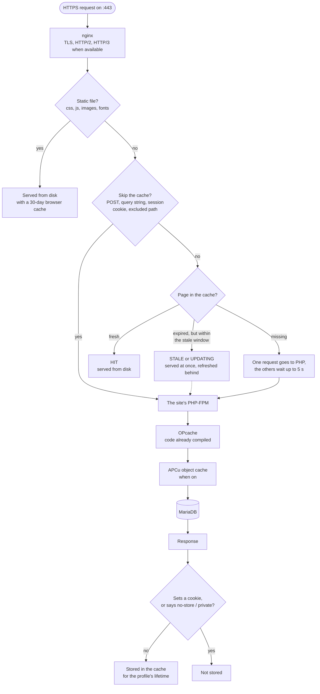

A page served from the cache never touches PHP: nginx reads it from disk. This page follows a
request to a PHP site (WordPress, WooCommerce, PHP, Laravel) and shows where it stops. The exact
values are in the [cache reference](/reference/cache-behaviour).

## The path {#diagram}

## nginx and the page cache {#page-cache}

The page cache is nginx's FastCGI cache, one per site, on disk under
`/var/cache/cloudground/<domain>`. A page's key is scheme, method, host and address. Every response
from PHP, when the page cache is on, carries the `X-CloudGround-Cache` header with the status nginx
gave the request: `HIT`, `MISS`, `BYPASS`, `EXPIRED`, `STALE`, `UPDATING` or `REVALIDATED`.

Three mechanisms keep the load on PHP low:

- **Coalescing.** When a hundred visitors ask for the same expired page at the same moment, only one
  reaches PHP. The others wait for its answer, up to 5 seconds.
- **Stale-while-revalidate.** A page that has just expired is served at once as it was, and nginx
  regenerates it in the background. The same happens when PHP answers with an error or not at all.
- **Tracking parameters.** An address with only parameters such as `utm_*`, `fbclid` or `gclid`
  uses the same entry as the page without them: a campaign does not send every click to PHP.

## When the cache stays out of it {#bypass}

Each site type has its own rules for skipping the cache: a `POST`, a query string that is not only
tracking, a session cookie (for WordPress the login, WooCommerce's cart), a path such as `/wp-admin`
or `/checkout`. A request with an `Authorization` header always skips the cache.

The most important rule holds for all of them: **a response that sets a cookie is never cached.**
A page generated for a visitor with a session is never served to someone else.

## PHP {#php}

When the request reaches PHP, the site's own PHP-FPM process serves it, holding only that site's
data:

- **OPcache** keeps the compiled PHP code in memory. It checks whether a file changed at most every
  60 seconds; after a release the panel reloads PHP so the new code shows at once.
- **Object cache** (WordPress, when you turn it on) keeps the results of repeated queries in APCu:
  it speeds up wp-admin, the cart and every page the page cache cannot serve.
- **MariaDB** runs on the same server, configured for its memory and CPUs.

PHP compresses its own response, so the cache stores the page already compressed and serves it
without compressing it again.

## The other site types {#other-types}

A static site has no PHP: nginx serves the files from disk. A reverse proxy passes every request to
its upstream. Neither has a page cache.

## Next step {#next}

To take a page or a whole site out of the cache, follow [purge the cache](/data/purge-the-cache).
