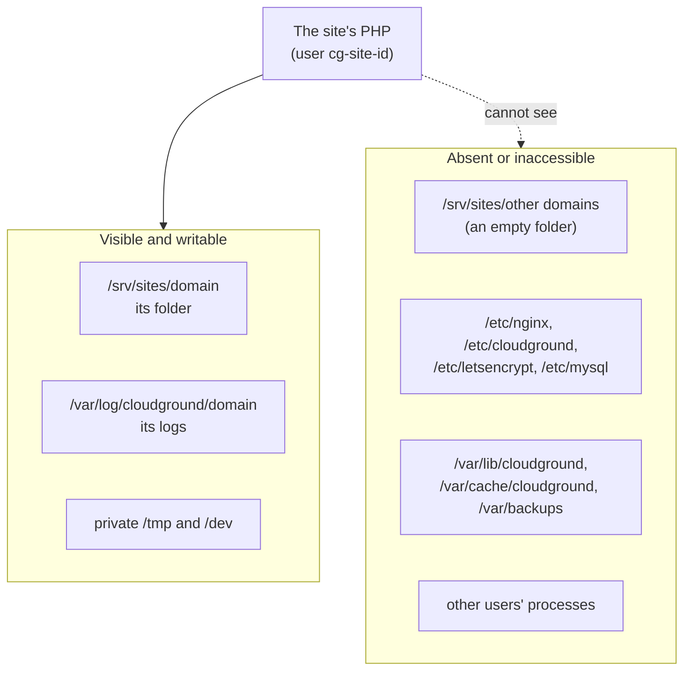

On a CloudGround server every site is a tenant that does not trust the others. A compromised plugin on
one site must not read another site's files, cache or database, and must not reach the panel. The
isolation has several layers, and each one holds even when another gives way.

## One user per site {#one-user-per-site}

Every site has its own system user and group, `cg-site-<id>`, with no login shell. Its folder,
`/srv/sites/<domain>`, belongs to root with the site's group and mode 0750: other sites cannot open
it. nginx gets in because its user is a member of every site's group.

The folder's skeleton (the root, `releases/`, `.ssh/` and the `current` link) stays root's. If it were
the site's, the site could swap a release for a symbolic link and point `current`, and nginx's served
folder with it, anywhere. The server re-asserts this ownership before every release and rollback.

The site's database, `site_<id>`, has a user of the same name with rights on that database only, and
at most 50 connections. Its password is generated at random when the site is created.

## One PHP per site, in a sandbox {#one-php-per-site}

Every site with PHP has a PHP-FPM master process of its own, running as the site's user. Two reasons:

- OPcache and APCu live in the master's shared memory. With one master for several sites, each could
  read and overwrite the others' cached objects.
- Those caches are sized per master: one master per site allows a size per site.

The master's service runs in a systemd sandbox. The site sees this:

In detail:

- `/srv/sites` and `/var/log/cloudground` are, for the site, empty in-memory folders where only its
  own folder and its own log folder are mounted;
- the rest of the system is read-only, and the configuration of the panel, nginx, the certificates
  and the database, the panel's state, the page cache and the backups are inaccessible;
- other users' processes are invisible, `/tmp` and `/dev` are private;
- no extra privilege: no capabilities, setuid programs grant nothing, no new namespaces, only Unix
  and IP sockets;
- PHP cannot start commands: `exec`, `passthru`, `shell_exec`, `system`, `proc_open` and `popen` are
  disabled.

The site's scheduled tasks, wp-cli commands and SSH shell run in the same sandbox, taken from the same
list: they cannot drift apart. Every process of the site sits in its own systemd slice,
`cg-site-<id>.slice`, so deleting the site stops them all together.

### Why not open_basedir {#why-not-open-basedir}

`open_basedir` is PHP checking the paths it opens by itself. The boundary here is the service's mount
namespace: what the site must not see is simply not there, for PHP and for any program PHP might use.
On the test server, `open_basedir` cost 28% of uncached requests per second. The panel does not turn
it on.

## nginx and symbolic links {#nginx-and-symlinks}

nginx can read every site, because it is in every site's group. That is why every site's vhost has
`disable_symlinks if_not_owner`: nginx follows a link only when the link and its target have the same
owner. A link the site makes to another site's folder is the site's, its target is not, and nginx
refuses it. With a public folder (`public_root`) the check starts at `current`, and the panel refuses
a public folder whose path goes through a link.

The routing an administrator writes for a site cannot leave its folder or proxy to the server's
services: see [Edit the routing](/sites/edit-routing).

## The server works inside the site's folder {#root-inside-the-tree}

The panel's operations on a site's files (releases, restores, ownership, copies for staging) run with
root's privileges. The site can rename or replace with a link anything it owns, even while root is
working on it. So every root operation on a site's folder opens its paths with `openat2` and
`RESOLVE_BENEATH`: the kernel guarantees, at every open, that the path stays inside the folder. A link
pointing out is refused, not followed. Without `openat2` the operation fails; it does not fall back to
a plain open.

The site's own links (`current`, `wp-config.php`, `wp-content/uploads`) are relative, so they resolve
inside the folder.

## SFTP {#sftp}

With SFTP on, the site's user signs in locked into its folder (chroot), with only the internal SFTP
server and no shell. With SFTP off, the user is in a group the SSH server refuses, even with a key.

## Next step {#next}

[The lifecycle of a site](./site-lifecycle.mdx): how these pieces are made and removed.
