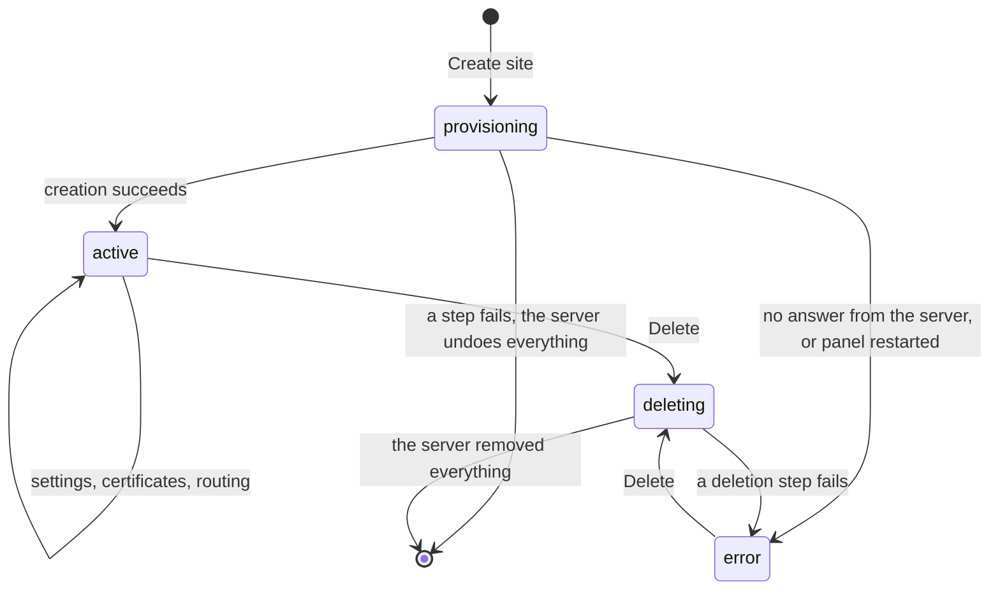
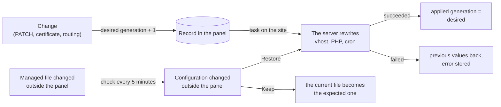

A site lives in two places. The panel keeps the **record**: the domain, the type and the settings you
want. The server keeps **what runs**: the system user, the files, PHP, the vhost. The lifecycle is how
the two stay in agreement, even when something stops halfway.

## The states {#the-states}

**Provisioning.** The panel stores the record and queues the **Site creation** task. The server
creates, in order: the user, the folder, the database, the first release with the application, the
vhost and PHP, and for WordPress the cron. Each step has its undo. When a step fails, the server undoes
the steps already done in reverse order, and the panel removes the record: nothing is left half made.

**Error, rather than vanishing.** When the panel gets no answer, because the server does not respond
or the task times out, it does not know what was created. The site may exist and serve pages. So the
panel keeps the record in **error**: removing it would leave a site no page shows, whose domain could
never be created again. A deletion cleans everything up.

**Active.** The site answers. Every change goes through the desired configuration (below).

**Deleting.** The server removes the routing first, so the site stops answering, then its processes,
PHP, scheduled tasks, database, certificates, user and finally the files. Each step removes only what
is still there, so a repeated deletion succeeds. When a step fails, the others still run and the site
ends in **error** with every reason.

A task cut short by a panel restart puts a site left **provisioning** or **deleting** in **error**. A
creation cancelled before it started removes the record; a deletion cancelled before it started gives
the site its previous status back.

## Desired and applied {#desired-and-applied}

The record carries a **desired generation**, which goes up with every change of the configuration,
and an **applied generation**, which says how far the server has put it into practice.

- Every change is a task holding the site's lock: two changes of the same site never overlap, and
  each task reads the site again as it is when it starts.
- When the server cannot apply it, the panel puts the previous values back, but only for the fields
  no later change has already set.
- The server does not rewrite a file that has not changed, and does not reload nginx when no nginx
  file changed. A PHP service whose configuration comes out the same keeps running, with its cache.

## Managed files and outside changes {#managed-files-and-drift}

Every file the server writes for a site (the vhost, the cache zone, the PHP configuration and
service, the staging password, the WordPress connector) is recorded with its SHA-256 fingerprint.
Every 5 minutes the panel compares the fingerprints with the files on disk. A file changed outside the
panel shows on the dashboard under **Configuration changed outside the panel**, and the panel
overwrites nothing by itself. An administrator chooses:

- **Restore**: the server rewrites the site's configuration as the record has it;
- **Keep**: the file's current version becomes the expected one.

Every 5 minutes the panel also renders the sites' configuration again after a panel upgrade or when
the number of sites changes, because the memory for PHP workers is shared among the sites.

## Next step {#next}

[Site isolation](./site-isolation.mdx): what keeps one site apart from the others.
