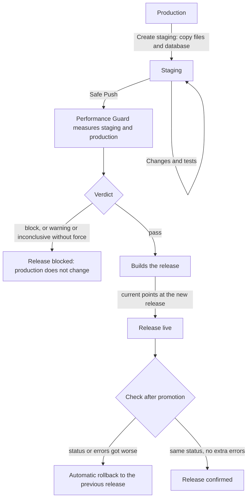

Staging is where you try a change on a copy of production. Safe Push publishes it only if it does
not make the site slower, heavier or broken. Performance Guard is the part that measures.

## Staging is a real site {#a-real-site}

The staging copy is a site like any other: it has its own system user, folder, database, PHP pool
and vhost, at `staging.<domain>`. When you create it, the panel:

- copies production's live release and uploaded files without following links, so the copy
  cannot reach production's files;
- copies production's database into staging's;
- on WordPress, puts staging's database in the configuration, `WP_ENVIRONMENT_TYPE` = `staging`,
  a panel token different from production's, and new session keys: whoever gets into staging
  cannot sign a login to production;
- rewrites production's addresses to staging's, in the JSON form (`\/\/domain`) used by blocks
  too;
- asks search engines not to index it and protects it with a password.

## What gets published {#what-is-published}

**Code.** Safe Push builds a new production release from staging's live release, or from
production's code with only the chosen paths taken from staging. Either way `wp-config.php` and
the uploaded files stay production's: a release that comes from staging does not carry its
credentials.

**Tables.** The database is published separately, table by table. Some tables are never
published, because in production they hold live data that staging has in an old version:

- WordPress users (`*_users`, `*_usermeta`);
- on a store, also posts, metadata and comments (where orders and reviews live) and the tables of
  orders, sessions, customers, payment tokens, downloads, reserved stock and API keys.

A site is a store if its type is WooCommerce, if it uses the *commerce* profile, or if its database
has tables of a WooCommerce installed by hand. Before replacing the tables, the panel takes a
safety snapshot of production and checks it; afterwards it puts back production's `blog_public`
value, because staging's would stop production being indexed.

## The Safe Push flow {#flow}

## How Performance Guard measures {#how-guard-measures}

Two sites on the same server never answer in the same time: a backup, a cron job or a noisy
neighbour change everything from one minute to the next. Performance Guard removes that noise with
three choices.

**Paired measurements.** For each page it runs 200 rounds. In each round it requests the page from
staging and production, in a random order. Whatever happens on the server falls on both halves of
the same round, so the ratio between them measures only the difference in code.

**PHP's own time.** Every request skips the page cache and carries a key that asks the panel's
plugin to write, at the end of the page, the render time, the queries and the memory. Performance
Guard uses that time, not the network's. On a site without the plugin it uses the time measured
by the client, and the report says so.

**Warm-up.** Before measuring, it sends each side at least twice as many requests as there are PHP
workers, so no measurement is a worker's first with a cold code cache.

A page gets a **block** verdict when:

- staging answers with a different HTTP status from production in more than 10% of the rounds;
- staging has more errors than production, above 1%;
- with 95% confidence it is more than 10% slower, and the median difference is over 25 ms;
- it runs at least 50% more queries (and at least 5), or uses at least 30% more memory (and at
  least 32 MiB).

With less certainty the verdict is **warning**; when the server moves too much to tell, or there
are fewer than 20 measurable pairs, it is **inconclusive**. Safe Push publishes on *pass*; on
*warning* or *inconclusive* only when the request forces it; on *block* never.

The threshold is 10% because staging and production are different sites, with their own database
and caches, and the same code can differ by a few points. The 200 rounds are there to still catch
a 30% regression: in the calibration runs it was almost always blocked, while two identical
versions were not. The price is time: about two minutes per page.

## The check after promotion {#after-promotion}

Right after the new release goes live, the cache is empty and PHP has just reloaded: timings are
not comparable and are not judged. Performance Guard sends production 20 requests per page and
checks only status and errors. If a page answers with a different status than before, or with more
errors, the panel goes back to the previous release and marks the new one as regressed, so it never
goes live again by mistake.

## Next step {#next}

[Staging and Safe Push](/data/staging-and-safe-push): the steps in the panel.
