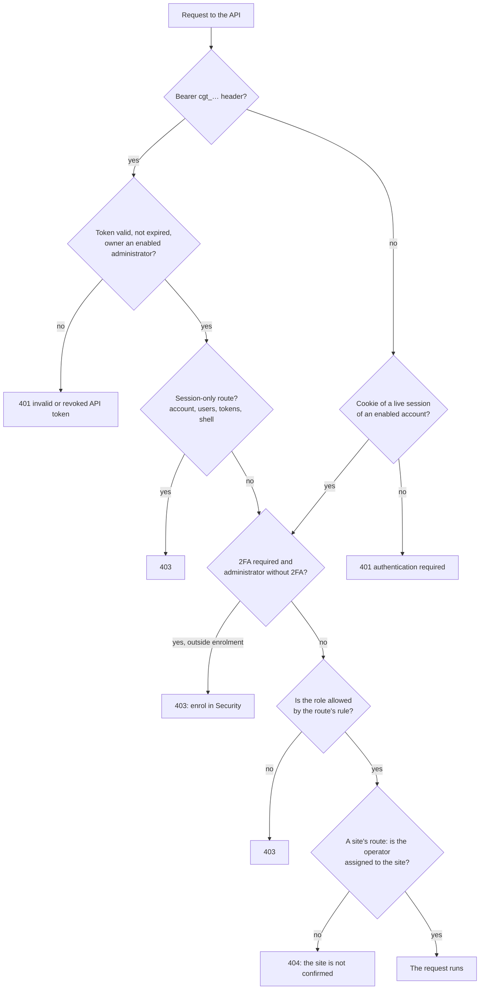

Every account has exactly one of three roles. To assign them see [users and roles](/access/users-and-roles).

| Role | API value | Reach |
| --- | --- | --- |
| **Administrator** | `admin` | The whole server. |
| **Operator** | `operator` | Its assigned sites only, and their staging copies. |
| **Read-only** | `readonly` | Sees the whole server, changes nothing. |

## How the panel decides {#how-the-panel-decides}

Every request goes through these checks, in this order. The first one that refuses answers.

A site out of an operator's reach answers **404**, not 403: the panel does not confirm that it
exists.

## Route rules {#route-rules}

Every API route has one of these rules.

| Rule | Administrator | Operator | Read-only |
| --- | --- | --- | --- |
| open | yes | yes | yes |
| signed in | yes | yes, on assigned sites | yes |
| whole server (`global`) | yes | no | yes |
| manage (`manage`) | yes | yes, on assigned sites | no |
| administrator (`admin`) | yes | no | no |

## What each role can do {#what-each-role-can-do}

*Sees* means read; *yes* means change too. For the operator, everything holds on its assigned sites
only.

| Area | Administrator | Operator | Read-only |
| --- | --- | --- | --- |
| Site list and details | yes | sees its own | sees |
| Create and delete sites | yes | no | no |
| Site settings and PHP version | yes | yes | no |
| Routing editor (Vhost) | yes | no | no |
| Site certificates | yes | yes | sees |
| Purge and warm the cache | yes | yes | sees the statistics |
| Releases: deploy, promote, roll back | yes | yes | sees |
| Staging and Safe Push | yes | yes | no |
| Backups: run, restore test, restore | yes | yes | sees |
| Backups: delete, retention, test the repository | yes | no | no |
| Files: list | yes | yes | sees |
| Files: read, write, upload, download | yes | yes | no |
| Database: query, export, import | yes | yes | sees the details |
| DB Studio: tables, rows, read queries | yes | yes | yes, through a read-only database user |
| DB Studio: edit, alter, export, import | yes | yes | no |
| WordPress: wp-admin sign-in, updates, object cache | yes | yes | sees the plugins |
| SFTP access and "SFTP only" keys | yes | yes | sees the keys |
| Site shell and "shell" keys | yes, from a session | no | no |
| Scheduled tasks | yes | yes | sees |
| Import a migration | yes | yes, without changing the expansion limit | no |
| A site's logs | yes | yes | yes |
| Server logs, services, firewall, status and metrics | yes | no | sees |
| Restart services, firewall rules | yes | no | no |
| Changes made outside the panel | yes | no | sees |
| Audit log | sees | no | sees |
| Panel settings | yes | no | sees (secrets masked) |
| Panel domain, panel updates | yes | no | no |
| Alerts | sees, dismisses | sees its own, dismisses | sees |
| Background tasks | sees, cancels | sees its own, cancels its sites' | sees |
| Users | yes, from a session | no | sees |
| API tokens | yes, from a session | no | no |
| Your own account: password, 2FA, sessions, profile | yes | yes | yes |

## API tokens {#api-tokens}

An API token has no permissions of its own: it acts as the administrator who created it, while that
owner is an enabled administrator, and follows the same two-step verification rule. There are no
tokens limited to one area. Only an administrator creates tokens.

A token never reaches the session-only routes: your own account (password, 2FA, sessions, profile),
users, tokens and the site shell. Nor can it add a key of type "shell". These refusals answer
**403**.

The panel revokes an account's tokens when its password is changed or reset, when it turns two-step
verification off, when it is disabled, demoted or deleted, and with `panel-api recover-admin`.

## The connector token {#connector-token}

Every WordPress site has a connector token, separate from the accounts, which only the site's plugin
uses to ask the panel to purge its pages from the cache. It gives access to nothing else.

## Next step {#next}

Create the accounts with the right role: [users and roles](/access/users-and-roles).
